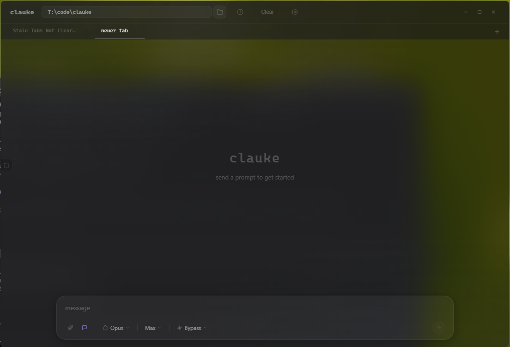

<p align="center">
  
</p>

<h1 align="center">clauke</h1>

<p align="center">
  A beautiful cloak around <a href="https://docs.anthropic.com/en/docs/claude-code">Claude Code</a> CLI.
</p>

<p align="center">
  
  
  
</p>

---

**clauke** is a lightweight desktop wrapper around the `claude` CLI. It doesn't reimplement any Claude functionality — it simply spawns `claude --output-format stream-json` and renders the streaming events in a polished UI.

<p align="center">
  
</p>

## Features

- **Multi-tab sessions** — run parallel conversations, fork from any message
- **Streaming markdown** — syntax-highlighted code blocks, tables, diffs
- **Tool call cards** — collapsible display for every tool invocation with inline diffs
- **Sub-agent tracking** — live sidebar showing nested agent activity
- **File tree** — see which files were touched, with diff stats
- **Task panel** — TodoWrite tasks rendered as a checklist
- **Context indicator** — visual fill bar showing context window usage
- **Session history** — archive and restore past conversations
- **Settings** — theme, MCP servers, hooks, permission modes
- **Keyboard shortcuts** — Ctrl+T/W/L/B/1-9, Ctrl+/ for cheatsheet
- **Custom titlebar** — frameless window, draggable, native window controls
- **Tiny footprint** — uses system WebView2, no bundled Chromium (~3 MB installer)

## Prerequisites

- [Claude Code CLI](https://docs.anthropic.com/en/docs/claude-code) installed and authenticated (`claude` must be in PATH)
- [Node.js](https://nodejs.org/) 18+
- [Rust](https://rustup.rs/) toolchain (for building from source)
- Windows 10/11 with WebView2 runtime (pre-installed on Windows 11)

## Install

Download the latest release from the [Releases](../../releases) page:

| File | Description |
|------|-------------|
| `clauke_x.x.x_x64-setup.exe` | NSIS installer (recommended) |
| `clauke_x.x.x_x64_en-US.msi` | MSI installer |

## Build from source

```bash
# Clone the repo
git clone https://github.com/mattiundtim/clauke.git
cd clauke

# Install frontend dependencies
npm install

# Run in development mode (hot reload)
npm run tauri dev

# Build release
npm run tauri build
```

Release artifacts are written to `src-tauri/target/release/bundle/`.

## Tech stack

| Layer | Technology |
|-------|-----------|
| Shell | [Tauri 2](https://v2.tauri.app/) — native desktop, system webview |
| Backend | Rust — CLI process management, IPC |
| Frontend | [Svelte 5](https://svelte.dev/) — reactive UI with runes |
| Rendering | [marked](https://marked.js.org/) + [highlight.js](https://highlightjs.org/) |

## How it works

1. You type a prompt in the input bar
2. The Svelte frontend calls the Rust backend via Tauri IPC
3. Rust spawns `claude -p "prompt" --output-format stream-json`
4. Each JSON line from stdout is emitted as a Tauri event
5. The frontend parses events into reactive state and renders them

clauke never calls the Anthropic API directly — all interaction goes through the official CLI.

## License

MIT
